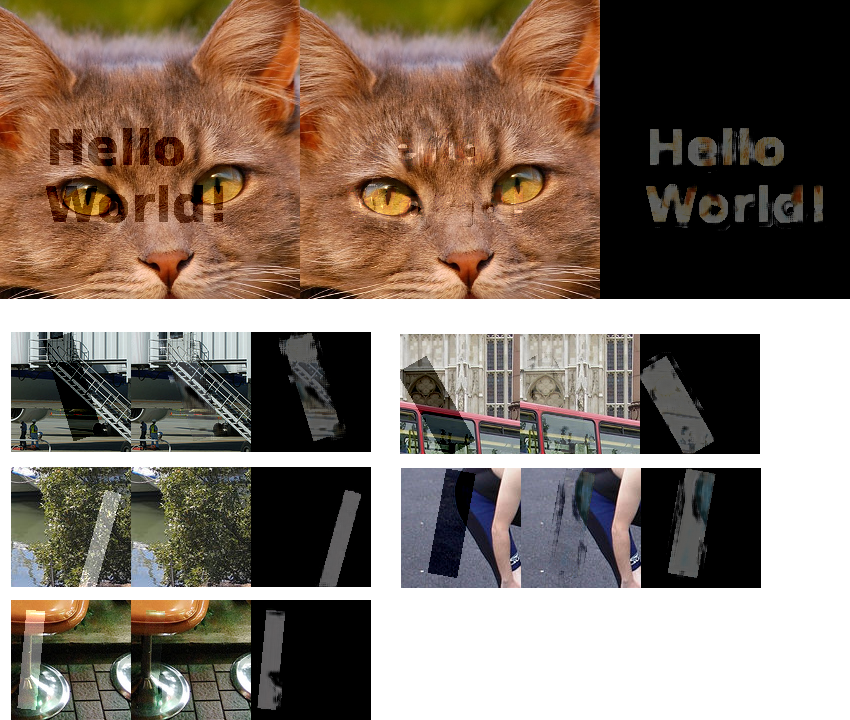

**Warning!** The architecture used in this project **does not generalize well**. You may want to check **https://dmitryulyanov.github.io/deep_image_prior**. This inpainting technique will likely give you better results.

# Fully convolutional watermark removal attack

Deep learning architecture to remove transparent overlays from images.

***Top:** left is with watermark, middle is reconstruction and right is the mask the algo predicts (the neural net was never trained using text or this image)*

***Bottom:** Pascal dataset image reconstructions. When the watermarked area is saturated, the reconstruction tends to produce a gray color.*

## Design choices

At train time, I generate a mask. It is a rectangle with randomly generated parameters (height, width, opacity, black/white, rotation). The mask is applied to a picture and the network is trained to find what was added. The loss is abs(prediction, image_perturbations)**1/2. It is not on the entire picture. An area around the mask is used to make the problem more tractable.

The network architecture does not down-sample the image. The prediction with a down-sampling network were not accurate enough. To have a large enough receptive field and not blow up the compute, I use dilated convolution. So concretely, I have a densenet style block, a bunch of dilated convolutions and final convolution to output a picture (3 channels). I did not spend much time doing hyper-parameters optimization. There's room to get better results using the current architecture.

Limitations: this architectures does not generalize to watermarks that are too different from the one generated with `create_mask` and it produces decent results only when the overlay is applied in an additive fashion.

## Usage

This project uses Tensorflow. Install packages with`pip install -r requirements.txt`

You will need the jpeg library to compile Pillow from source: `sudo apt-get install libjpeg-dev zlib1g-dev`

You will also need to **download the pascal dataset** (used by default) from http://host.robots.ox.ac.uk/pascal/VOC/voc2012/ or CIFAR10 python version from https://www.cs.toronto.edu/~kriz/cifar.html (use flag `--dataset=dataset_cifar`). Make sure the extract the pascal dataset under a directory called `data`. The project directory should then have the directory `cifar-10-batches-py` and/or `data/VOCdevkit/VOC2012/JPEGImages`. If you want to use your own images, place them in `data/VOCdevkit/VOC2012/JPEGImages/`.
 
To train the network `python3 watermarks.py --logdir=save/`. It starts to produce some interesting results after 12000 steps.

To use the network for inference, you can run `python watermarks.py --image assets/cat.png --selection assets/cat-selection.png` this will create a new image `output.png`.

## Pretrained weights

Here you can find the weights: https://github.com/marcbelmont/cnn-watermark-removal/files/1594328/data.zip
put them in /tmp/
